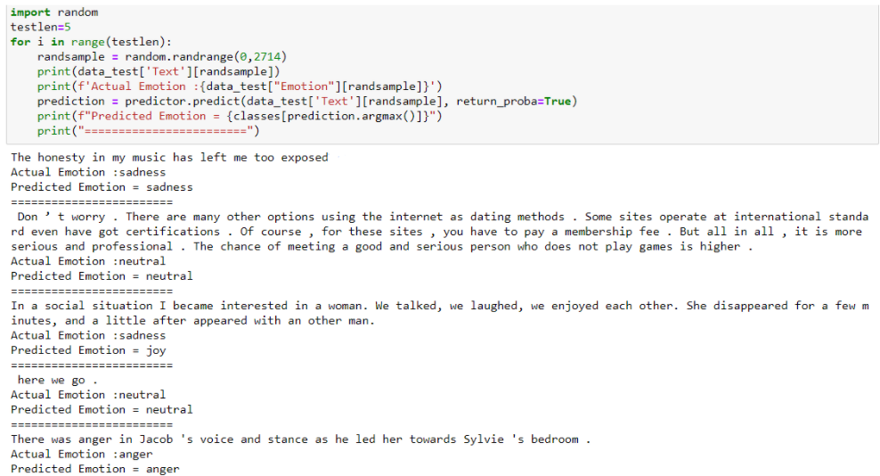
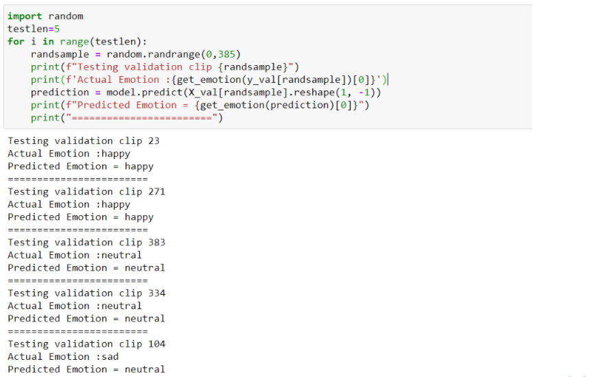

# **Deep Audiobook Tuner (DAT)**

A system that generates an apt, emotionally pertinent, unique musical score for an audiobook automatically based on the current narrative for the purpose of ameliorating user-experience while being accurate, cost-efficient, and time saving.

## **Table of Contents:**

1. <a href="#About">About</a>
2. <a href="#FS">Folder Structure</a>
3. <a href="#Inst">Installation</a>
4. <a href="#Run">How to run the application?</a>
5. <a href="#Results">How it works?</a>
6. <a href="#Collab">Collaborators</a>

---

## <a name="About">**1. About**</a>

Audiobooks are being used on a regular basis by hundreds of users. The system in this report aims to develop emotionally relevant music for preexisting audiobook recordings. The user will enter an audiobook MP3 file as an input to the system. This audiobook will then go through two processes, simultaneously.

- First, the input audiobook will be converted to wav format and will be run through a transcription tool to extract the text from the audiobook. This text will then be analyzed using a Text-Based Sentiment Analyzer (TBSA).
- In the second process, the audio features from the audiobook will be extracted. The audio features are then analyzed by an Audio-Based Sentiment Analyzer (ABSA) that will predict the emotions being conveyed in the audio.

Now the system will have obtained 2 values (sentiments) predicted by both, the TBSA as well as the ABSA. The values may vary and lead to an error. To avoid this, the weighted average of values will be calculated in order to generate the final predicted sentiments.

As for the music generation model, we treat music as a language and using Transformer XL we generate unique musical scores for every sentiment considered by the system.

Utilizing the list of predicted sentiments as well as the music generated by the music generation model our application generates a seamless, distinctive musical score for every segment. These scores are stitched together along with the input audio file to provide the user an audiobook with felicitous background tunes.

<p align="center">
    
</p>

## <a name="FS">**2. Folder Structure**</a>

```
DeepAudiobookTunerApp
├───assets
│   ├───audiobooks
│   ├───audio_sentiment_data_v1
│   │   ├───checkpoints
│   │   ├───dataset
│   │   └───models
│   ├───audio_sentiment_data_v2
│   │   ├───datasets
│   │   ├───data_features
│   │   ├───models
│   │   ├───pickles
│   │   └───tuners
│   ├───audio_transcription
│   │   └───deepspeech-0.6.0-models
│   ├───music_generation
│   │   ├───datasets
│   │   ├───models
│   │   └───pickles
│   ├───temp
│   └───text_sentiment_data
│       ├───datasets
│       └───models
|
├───deepaudiobooktuner
│   ├───music_generation
│   │   └───music_transformer
│   ├───sentiment_analysis
│   └───utils
|
├───images
|
├───notebooks
│   ├───demo
│   ├───music_generation
│   └───sentiment_analysis
│       ├───audio_segmentation
│       ├───audio_sentiment_analysis_v1
│       │   └───feature_ext_and_dataprep
│       ├───audio_sentiment_analysis_v2
│       │   └───feature_ext_and_dataprep
│       ├───audio_transcription
│       ├───text_sentiment_analysis
│       └───text_sentiment_analysis_v2
|
└───tests
```

---

## <a name="Inst">**3. Installation**</a>

Install the requirements for [Tensorflow](https://www.tensorflow.org/install) before you run the following commands.

Run `pip install -r requirements.txt` to install all the required libraries (python version = 3.7)

Or

Create a conda environment: `conda env create -f environment.yml`  
(This method requires tensorflow 2.4 to be installed seperately in the environment.  
Run `conda activate deepaudiobooktuner` and `pip install tensorflow==2.4.1`)

Additional requirements:

- Ffmpeg. It can be installed from [here.](https://www.ffmpeg.org/download.html)

- FluidSynth. It can be installed from [here.](https://github.com/FluidSynth/fluidsynth/releases/tag/v2.2.0)
  - FluidSynth requires a soundfont which can be downloaded [here.](https://member.keymusician.com/Member/FluidR3_GM/index.html)

---

## <a name="Run">**4. How it works?**</a>

---

## <a name="Results">**5. Results**</a>

## **Analysis**

### Sentiment Analysis Accuracy Metrics:

| Text-Based                                                              | Audio-Based                                                             |
| ----------------------------------------------------------------------- | ----------------------------------------------------------------------- |
|  |  |

## **Validation**

### Text-Based Sentiment Analysis Validation:

<p align="center">
    
</p>

### Audio-Based Sentiment Analysis Validation:

<p align="center">
    
</p>

---

## <a name="Collab">**6. Collaborators:**</a>

- [Daniel Lobo](https://github.com/danlobo1999)
- [Jenny Dcruz](https://github.com/jendcruz22)
- [Smita Deulkar](https://github.com/smita3199)
- [Leander Fernandes](https://github.com/fernandeslder)
