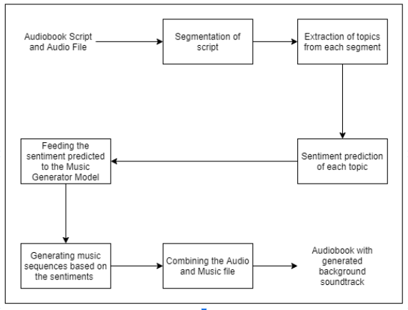

# deep-audiobook-tuner

A system that generates an apt, emotionally pertinent, unique musical score for an audiobook automatically based on the current narrative for the purpose of ameliorating user-experience while being accurate, cost-efficient, and time saving.

## **About:**
Audiobooks are being used on a regular basis by hundreds of users. The system in this report aims to develop emotionally relevant music for preexisting audiobook recordings. The user will enter an audiobook MP3 file as an input to the system. This audiobook will then go through two processes, simultaneously. 

*   First, the input audiobook will be run through a transcription tool to extract the text from the audiobook. This text will then be analysed using a Text-Based Sentiment Analyzer (TBSA).  
*   Concomitantly, in the second process, the features of the audio from the audiobook that is given by the user, will be extracted. The audio features are then analysed by an Audio-Based Sentiment Analyzer (ABSA) that will predict the emotions being conveyed in the audio. 

Now the system will have obtained 2 values (sentiments) predicted by both, the TBSA as well as the ABSA. The values may vary and lead to an error. To avoid this, the weighted average of values will be calculated in order to generate the  final predicted sentiments. Utilizing these predicted sentiments as well as the music generation model that has been explained ahead in this report, our application generates a seamless, distinctive musical score for every segment. These scores are stitched together along with the input audio file to provide the user an audiobook with felicitous background tunes.

    

## Libraries to install

Run `pip install -r requirements.txt` to install all the required libraries
[Install the requirements for Tensorflow before you run this command](https://www.tensorflow.org/install)

Install ffmpeg in your conda environment `conda install -c conda-forge ffmpeg`

## **How it works?**
This application uses Flask, HTML, CSS, and JavaScript. 

The [main.py](https://github.com/jendcruz22/BE-Project/blob/master/main.py) file consists of the flask application. 

This flask application uses various templates that are created using HTML and are stored in the [templates](https://github.com/jendcruz22/BE-Project/tree/master/templates) folder.

The [CSS](https://github.com/jendcruz22/BE-Project/tree/master/static/css) and [JavaScript](https://github.com/jendcruz22/BE-Project/tree/master/static/js) files used by the HTML templates are stored in the [static](https://github.com/jendcruz22/BE-Project/tree/master/static) folder. This folder also consists of the images [icons](https://github.com/jendcruz22/BE-Project/tree/master/static/images/icons) and [fonts](https://github.com/jendcruz22/BE-Project/tree/master/static/css/font-awesome) that the application uses.

The main page ie the [index.html](https://github.com/jendcruz22/BE-Project/blob/master/templates/index.html) file consists of the basic details of this application: How it works, about the system, about the team, etc.

This application accepts mp3 audio files as input ([upload_file.html](https://github.com/jendcruz22/BE-Project/blob/master/templates/upload_file.html)) and saves a copy of it in the uploads folder. This audio file is then processed and made available for the user to listen to ([player.html](https://github.com/jendcruz22/BE-Project/blob/master/templates/player.html)). 

If the user is satisfied with the processed audio they get redirected to the [downloads page](https://github.com/jendcruz22/BE-Project/blob/master/templates/download.html) to download the audio file generated from the [downloads folder](https://github.com/jendcruz22/BE-Project/tree/master/downloads). 

If not, they can go back, upload the audio file and have it be processed again as each mp3 file produced as the output is unique and different from the other.

---

## **Collaborators:**

*   [Daniel Lobo](https://github.com/danlobo1999)
*   [Jenny Dcruz](https://github.com/jendcruz22)
*   [Smita Deulkar](https://github.com/smita3199)
*   [Leander Fernandes](https://github.com/fernandeslder)

