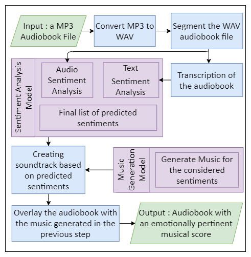

# **Deep Audiobook Tuner (DAT)**

A system that generates an apt, emotionally pertinent, unique sequences of music for audiobooks based on the current narrative for the purpose of ameliorating user-experience while being accurate, cost-efficient, and time saving.

This repository is about the innerworkings of DAT. Check out the Flask application made for this project at https://github.com/jendcruz22/DeepAudiobookTunerApp

This project was made in collaboration with:

- [Daniel Lobo](https://github.com/danlobo1999)
- [Jenny Dcruz](https://github.com/jendcruz22)
- [Smita Deulkar](https://github.com/smita3199)
- [Leander Fernandes](https://github.com/fernandeslder)

## **Table of Contents:**

1. <a href="#About">About</a>
2. <a href="#Structure">Folder Structure</a>
3. <a href="#Installation">Installation</a>
4. <a href="#Setup">Setup</a>
5. <a href="#Dataset">Datasets used</a>
6. <a href="#Notebooks">Notebooks</a>
7. <a href="#Results">Results</a>
8. <a href="#References">References</a>

## <a name="About">**1. About**</a>

Audiobooks are being used on a regular basis by hundreds of users. However most audiobooks do have background music or in some cases very generic soundtracks. This system aims to develop unique and emotionally relevant soundtracks for audiobook recordings.

To extract the sentiments from the audiobook, we use a hybrid sentiment analysis approach consisting of text as well as audio sentiment analysis. The text sentiment model is a product of transfer learning on [Google's BERT language model](https://github.com/google-research/bert). Both the text as well as the audio model have been trained on four emotions: Anger, Happiness, Neutral and Sadness.

In order to perform text sentiment analysis, we require the transcripts of the audiobook. We are using IBM's [Watson Speech to Text](https://www.ibm.com/in-en/cloud/watson-speech-to-text) to transcribe the audiobooks.

The audio sentiment model is a fully connected Dense Neural Network with four hidden layers. It takes in audio features as its input which are extracted from the audiobooks using [Librosa.](https://github.com/librosa/librosa)

For music generation, we've implemented [bearpelican's](https://github.com/bearpelican/) approach. They created a music generation model using transformers and built using the [fastai library](https://github.com/fastai/fastai). We are using their MusicTransformer model which uses [Transformer-XL](https://github.com/kimiyoung/transformer-xl) to take a sequence of music notes and predict the next note. A huge Thank you! to bearpelican and do check out their [project](<[musicautobot](https://github.com/bearpelican/musicautobot)>).

Given below is the workflow of our system:

<p align="center">
    
</p>

## <a name="Structure">**2. Folder Structure**</a>

```
deep-audiobook-tuner
├───assets
│   ├───audiobooks
│   ├───audio_sentiment_data_v1
│   ├───audio_sentiment_data_v2
│   │   ├───datasets
│   │   ├───data_features
│   │   ├───models
│   │   └───pickles
│   ├───music_generation_data
│   │   ├───datasets
|   |   |   └───vg-midi-annotated
│   │   ├───models
│   │   └───pickles
│   ├───temp
│   └───text_sentiment_data
│       ├───datasets
│       └───models
|
├───deepaudiobooktuner
│   ├───music_generation
│   │   └───music_transformer
│   ├───sentiment_analysis
│   └───utils
|
├───examples
|
├───images
|
├───notebooks
│   ├───demo
│   ├───music_generation
│   └───sentiment_analysis
│       ├───audio_segmentation
│       ├───audio_sentiment_analysis_v1
│       │   └───feature_ext_and_dataprep
│       ├───audio_sentiment_analysis_v2
│       │   └───feature_ext_and_dataprep
│       ├───audio_transcription
│       ├───text_sentiment_analysis
│       └───text_sentiment_analysis_v2
|
└───tests
```

## <a name="Installation">**3. Installation**</a>

Install the requirements for [Tensorflow](https://www.tensorflow.org/install) before you run the following commands.

Run `pip install -r requirements.txt` to install all the required libraries (python version = 3.7)

Or

Create a Conda environment: `conda env create -f environment.yml`  
(This method requires Tensorflow 2.4 to be installed separately in the environment.  
Run `conda activate deepaudiobooktuner` and `pip install tensorflow==2.4.1`)

Additional requirements:

- Ffmpeg is available [here.](https://www.ffmpeg.org/download.html)
- The package midi2audio requires a sound font which can be downloaded [here.](https://member.keymusician.com/Member/FluidR3_GM/index.html) The sound font should be place in **deep-audiobook-tuner/assets/music_generation_data/soundfont/** (Refer the <a href="#Structure">folder structure</a>)

## <a name="Setup">**4. Setup**</a>

To run this project the following API key and models are required.

#### Transcription API key

The transcription process is done using a cloud service, specifically IBM's Watson Speech To Text. In order to use this service an API key is required. Create a free account and obtain your API key and URL. These values are to be saved in a file called .env as shown here `api_key = 'your_api_key' url = 'your_url'` . Keep this file in the root directory.

#### Music generation model

The music generation model trained by [bearpelican](https://github.com/bearpelican/musicautobot) is available at [here.](https://ashaw-midi-web-server.s3-us-west-2.amazonaws.com/pretrained/MusicTransformerKeyC.pth) This model is to be placed in **deep-audiobook-tuner/assets/music_generation_data/models/** (Refer the <a href="#Structure">folder structure</a>)

#### Text sentiment analysis model

A pre-trained text sentiment analysis model is available [here.](https://drive.google.com/drive/folders/1rE-08BOk2R7O0oLoYnBusvFuJVVwUr1J?usp=sharing) This model is to be placed in **deep-audiobook-tuner/assets/text_sentiment_data/models/neubias_bert_model/** (Refer the <a href="#Structure">folder structure</a>)

## <a name="Dataset">**5. Datasets used**</a>

- Text Sentiment Analysis

  The [DailyDialog](http://yanran.li/dailydialog), [Emotion-Stimulus](https://www.site.uottawa.ca/~diana/resources/emotion_stimulus_data/) and [ISEAR](https://www.unige.ch/cisa/research/materials-and-online-research/research-material/) datasets were combined to create a balanced dataset with 4 labels: angry, happy, neutral and sad. We trained, validated and tested our model on these datasets and the accuracy obtained is discussed in the <a href="#Results">results section.</a>

- Audio Sentiment Analysis

  A combination of 3 datasets were used. The [TESS dataset](https://www.kaggle.com/ejlok1/toronto-emotional-speech-set-tess), the [RAVDESS dataset](https://www.kaggle.com/uwrfkaggler/ravdess-emotional-speech-audio) and the [SAVEE dataset.](https://www.kaggle.com/uwrfkaggler/ravdess-emotional-speech-audio) We trained, validated and tested our model on these datasets for the following emotions: Anger, Happiness, Neutral and Sadness. The accuracy obtained is discussed in the <a href="#Results">results section.</a>

- Music Generation

  For music generation, although we used a pre-trained model, we required our model to generate music according to the given emotion. For this we created a small hand labelled dataset of video-game piano music according to the emotions being used by our system. This dataset is used as the input for the music generation model. The data set is located here **deep-audiobook-tuner/assets/music_generation_data/datasets/vg-midi-annotated** (Refer the <a href="#Structure">folder structure</a>)

## <a name="Notebooks">**6. Source Code**</a>

- [deepaudiobooktuner/](https://github.com/danlobo1999/deep-audiobook-tuner/tree/main/deepaudiobooktuner)
- [sentiment_analysis/](https://github.com/danlobo1999/deep-audiobook-tuner/tree/main/deepaudiobooktuner/sentiment_analysis) - submodule for analyzing sentiment from the audiobook.
- [music_generation/](https://github.com/danlobo1999/deep-audiobook-tuner/tree/main/deepaudiobooktuner/music_generation) - submodule for generating emotional music.
- [deep_audiobook_tuner.py](https://github.com/danlobo1999/deep-audiobook-tuner/blob/main/deepaudiobooktuner/deep_audiobook_tuner.py) - consists of all the functions need to run the application.

## <a name="Results">**7. Results**</a>

Some examples of our system are available in the [examples directory](https://github.com/danlobo1999/deep-audiobook-tuner/tree/main/examples).

Given below are the accuracy metrics of our sentiment analysis models.

| Text-Based-Sentiment-Analysis                                           | Audio-Based-Sentiment-Analysis                                          |
| ----------------------------------------------------------------------- | ----------------------------------------------------------------------- |
|  |  |

## <a name="References">**8. References**</a>

[1] [Google's BERT model](https://github.com/google-research/bert)  
[2] [Ktrain wrapper for Keras](https://github.com/amaiya/ktrain/tree/23baf7cd75bdf44cb096438e7dd4c7b74734e472)  
[3] [Speech-Emotion-Analyzer](https://github.com/MITESHPUTHRANNEU/Speech-Emotion-Analyzer)  
[4] [Musicautobot](https://github.com/bearpelican/musicautobot)
